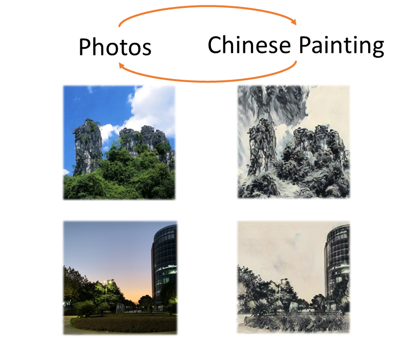

# GAN-based Chinese Painting Generation

## Author
[黄哲昊](https://github.com/K1nght) [叶瑜超](https://github.com/Messith)




## Source code
[pytorch-CycleGAN-and-pix2pix](https://github.com/junyanz/pytorch-CycleGAN-and-pix2pix)

## Environment
* torch>=1.4.0
* torchvision>=0.5.0
* dominate>=2.4.0
* visdom>=0.1.8.8

## Our datasets
* [cp2photo_v1](https://jbox.sjtu.edu.cn/l/aoMeaU): contains <font color=red>5382</font> photosincluding landscape photos, plant photos and animal pho-tos, <font color=red>1070</font> Chinese paintings including Chinese landscape painting, Chinese bird-and-flower painting and Chinesefigure painting.
* [cp2photo_v2](https://jbox.sjtu.edu.cn/l/KnHCBh): contains <font color=red>826</font> photos including almostall landscape photos and <font color=red>522</font> traditional Chinese paintingsincluding almost all landscape paintings.
* [cp2photo_v3](https://jbox.sjtu.edu.cn/l/EnSE2r): contains <font color=red>2194</font> landscapephotos and <font color=red>2686</font> Chinese landscape paintings.

Baiduyunpan link for these three datasets: https://pan.baidu.com/s/1cEgMAYsL8wLR17XnGa-vGA, password: 03ci

## 开启一次训练完整流程
* 登录Xshell 6连接服务器au332p10
* ```tmux new -s visdom```用于开启visdom训练可视化终端链接<br>
在tmux窗口内运行
```python -m visdom.server```<br>
然后ctrl b + d 退出tmux窗口
* 在自己电脑windows cmd终端使用ssh连接服务器<br>
```ssh -L 8097:127.0.0.1:8097 -p 3333 au332p10@202.120.39.51```<br>
然后使用本地浏览器访问 http://localhost:8097 就可以实时监控训练情况了

* 使用tmux另开一个窗口运行训练程序```tmux new -s session_name``` session_name为窗口名
* 在tmux窗口内运行 ```conda activate Pytorch```
* ```cd pytorch-CycleGAN-and-pix2pix```
* 开始训练<br>
```
 --dataroot: path to images (should have subfolders trainA, trainB, valA, valB, etc)
 --name: name of the experiment. It decides where to store samples and models
 --model: chooses which model to use, we use 'cycle_gan'
 --gpu_ids: gpu ids: e.g. 0  0,1,2, 0,2. use -1 for CPU
 --display_env: visdom display environment name (default is "main")
 --netG: specify generator architecture, choose from [resnet_9blocks | unet_256 ]
 --n_epochs: number of epochs with the initial learning rate
 --n_epochs_decay: number of epochs to linearly decay learning rate to zero
 --n_epochs_D: number of epochs to train the D per training the G, which must > 0
 the total epochs = n_epochs * n_epochs_D + n_epochs_decay
 --lr_policy: learning rate schedular, choose from [linear | step | plateau | cosine]
 --addnoise: add which noise data augmentation to the training img or none, choose from ['SaltPepper', 'Gaussian', 'SaltPepper_and_Gaussian', None]

 python train_more_D.py --dataroot ./datasets/datasets_name --name save_name --model cycle_gan --gpu_ids 0 --display_env env --netG resnet_9blocks --n_epochs 100 --n_epochs_decay 200 --lr_policy cosine --n_epochs_D 3
```
* 训练结果保存在checkpoints文件夹下
* ctrl b + d 退出tmux窗口
* ```tmux attach -t session_name```重新进入tmux窗口

## 使用已经训练好的模型得到测试结果
* 源代码中```test.py```使用epoch次的保存模型进行测试，得到Domain x 和Domain y的双向测试结果<br>
```
 --epoch: which epoch to load?
 --num_test: how many test images to run
 python test.py --dataroot ./datasets/datasets_name --name save_name --model cycle_gan --gpu_ids 0 --epoch 50 --netG resnet_9blocks
```
* 我们的```test_img.py```只得到从原图转换为水墨画
```
 --save_path: where to save the result
 python test_img.py --dataroot ./datasets/datasets_name --name save_name --model cycle_gan --epoch 50 --netG resnet_9blocks --save_path ./result/test
```

## 毛笔建模Demo
```
 python brush/brushwritev2.py
```
